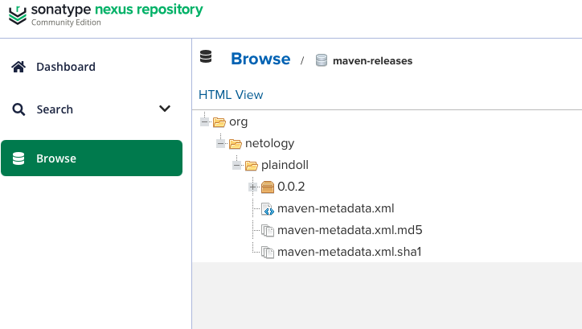
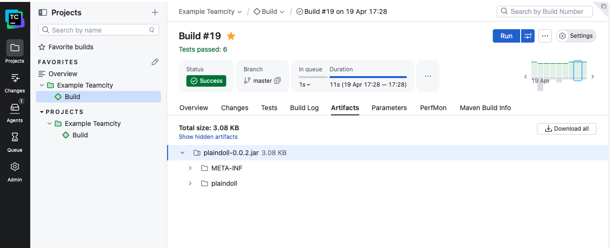
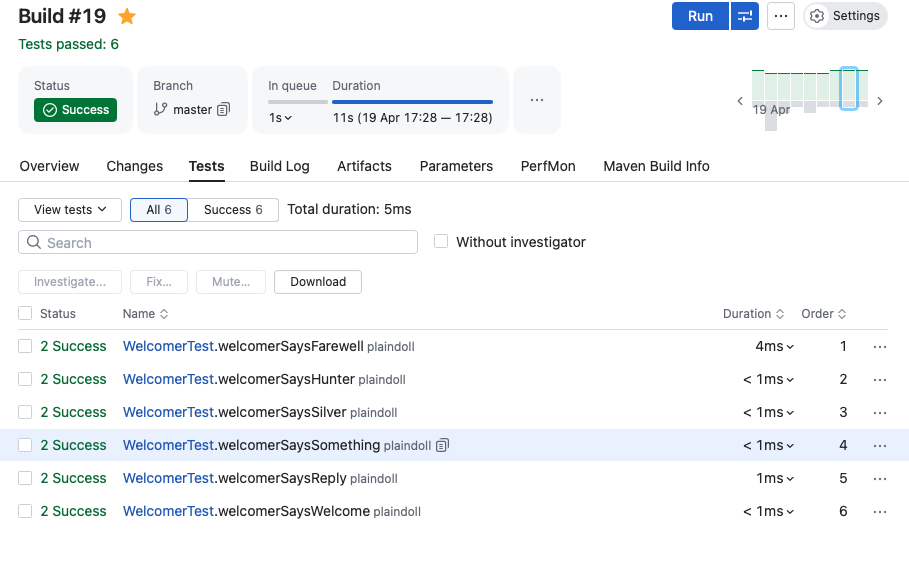

# Домашнее задание к занятию 11 «Teamcity»

## Выполнение

### Подготовка
- TeamCity Server, TeamCity Agent и Nexus развёрнуты локально через Docker Compose
- Агент авторизован в TeamCity
- Сделан fork репозитория: https://github.com/SavkinILYA/example-teamcity

### Основная часть
1. Создан проект в TeamCity на основе форка
2. Выполнен autodetect конфигурации — обнаружен Maven шаг
3. Настроены условия сборки:
   - ветка `master` → `mvn clean deploy`
   - остальные ветки → `mvn clean test`
4. Загружен `settings.xml` с кредами Nexus в Maven Settings TeamCity
5. В `pom.xml` прописан адрес Nexus репозитория
6. Сборка мастера прошла успешно, артефакт появился в Nexus
7. Конфигурация мигрирована в репозиторий (папка `.teamcity`)
8. Создана ветка `feature/add_reply`, добавлен метод `sayReply()` со словом `hunter`
9. Написан тест `welcomerSaysReply` на поиск слова `hunter`
10. Сборка по ветке запустилась автоматически, 6 тестов прошли успешно
11. Ветка смержена в `master` через Merge
12. Настроен artifact path: `target/plaindoll-*.jar`
13. Повторная сборка мастера прошла успешно, артефакт `plaindoll-0.0.2.jar` собран

## Скриншоты

### Артефакт в Nexus

### Артефакт .jar в TeamCity

### Тесты в TeamCity

## Ссылка на репозиторий
https://github.com/SavkinILYA/example-teamcity
